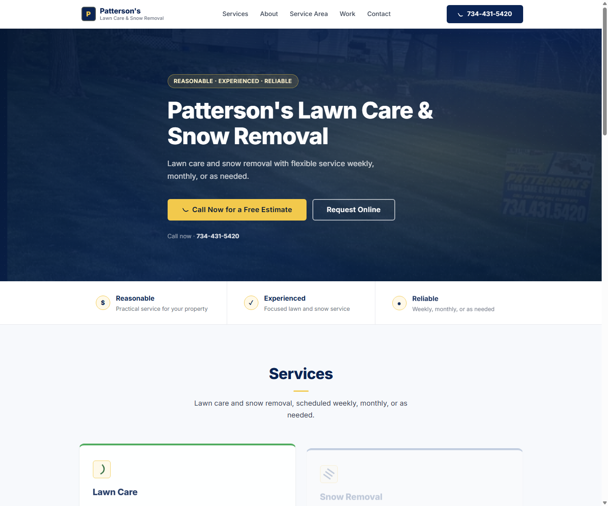
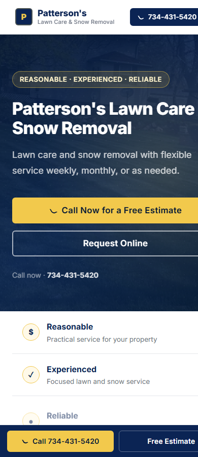

# Patterson's Lawn Care & Snow Removal

Local Service Website Demo / Client Preview

## Positioning

A local lawn care and snow removal website demo built from real business card materials, existing project assets, and confirmed service information. The goal is to give Patterson's a clearer online foundation with phone-first calls to action, service clarity, trust signals, and a future estimate request flow.

## Status

Client-review demo. Not public-launch ready until the Formspree estimate form endpoint is configured and tested.

Current blocker:

```text
feat: configure formspree endpoint
```

## Preview

Desktop:



Mobile:



## What This Demonstrates For Auralis

- Local service website work
- Turning a business card into a web presence
- Grounded copywriting from confirmed materials
- Mobile-first lead design
- Service business positioning
- Launch-readiness discipline

## Do Not Claim Yet

- Live client website
- Launched website
- Generating leads
- SEO optimized and ranking
- Google Business Profile completed

## Source Project

The working site lives in the Patterson repo:

```text
C:\Patterson-s-Lawn-Care
```

This Auralis folder is a demo/client-preview case study reference, not the production project source.
